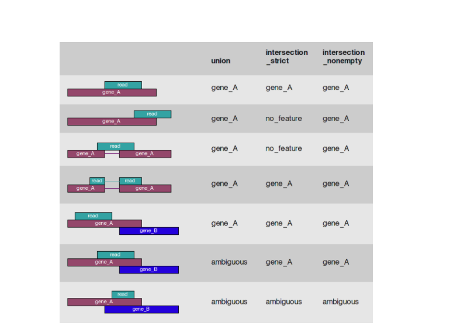

# 3.1.1 表达量分析

&emsp;&emsp;我们使用 HTSeq 统计比对到每一个基因上Read Count值，作为基因的原始表达量。Reads计数与基因的真实表达水平，以及基因的长度和测序深度成正相关。为了使不同基因、不同样本间的基因表达水平具有可比性，我们采用FPKM对表达量进行标准化（Nosrmalization），FPKM(Fragments Per Kilo bases per Million fragments)是每百万片段中来自某一基因每千碱基长度的片段数目，对于 Pair-End 测序，每个 Fragments 会有两个 Reads，FPKM 只计算两个 Reads 能比对到同一个转录本的 Fragments 数量。在有参转录组当中，我们一般认为FPKM>1的基因是表达的。这个阈值是主流杂志推荐的，也能够很好的反应基因的表达水平。 

&emsp;&emsp;统计方法如下：首先读取基因结构注释信息（GTF文件），然后将比对结果与基因结构进行比较并统计结果。HTSeq 有三种统计方案，如图1，其区别在于当一个 Read 仅有一部分覆盖在基因区域上或有一部分覆盖在基因的内含子区域时， Union 方案和 Intersection_nonempty 方案认定 Read 属于该基因，而 Intersection_strict 方案认定 Read 不属于任何基因；当一个 Read 全部覆盖在一个基因上，并且部分覆盖在另一个基因上时，Union 方案 认定 Read 同属于两个基因，Intersection_strict 方案和 Intersection_nonempty 方案则认定 Read 属于第一个基因。如无特殊要求，应按 Union 方案统计，该方案较为稳健（如果是链特异性建库，则还需要判别是否和注释中的 Feature 方向一致）。 

图1 Reads统计模式图

&emsp;&emsp;根据表达量的计算结果表格，将表达量分为不同的区间，对各样本在不同表达量区间内的基因的数目进行统计，结果见图2。 

{{details}}

图2 表达量区间统计图

{{result}}

