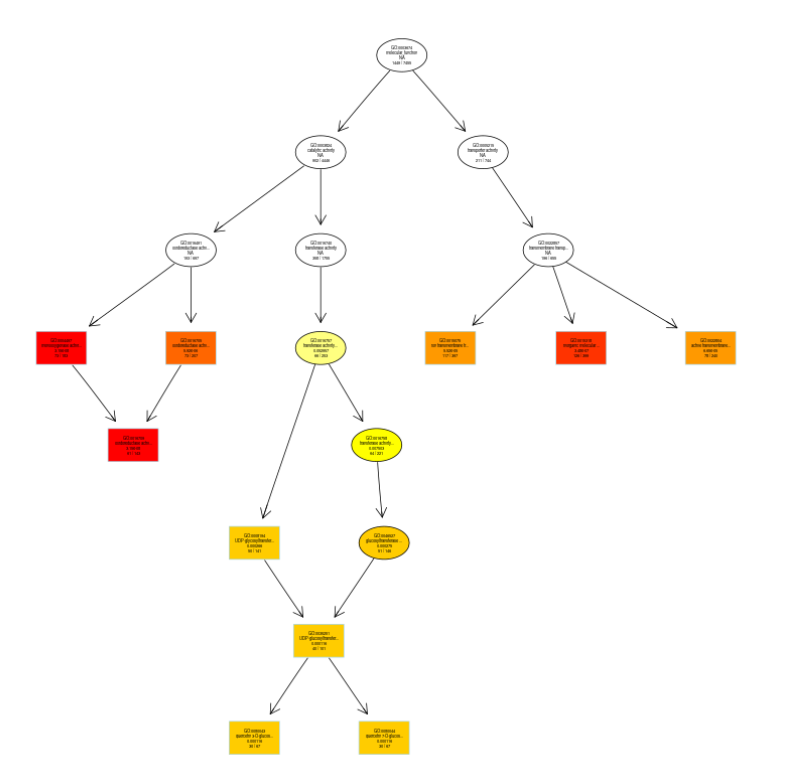

# 3.3.2 GO有向无环图
&emsp;&emsp;富集分析结果会分别给出GO三个 ontology（细胞组分、分子功能和生物过程）的有向无环图，在这个图中，越接近根结点的 GO term越概括，往下分支的 GO term为注释到更细层级的 term。 程序默认把显著性最高前10个GO term设置为方形，其他的GO term为圆形。颜色越深，代表该GO term越显著，颜色由浅到深为无色-浅黄-深黄-红色， 

图15 Gene Ontology DAG富集图（示例）

**注**：每个节点代表一个 GO 术语，分支代表包含关系，从上至下所定义的功能范围越来越小，方框代表富集程度 top10 的 GO 术语，颜色越深代表富集程度越高。

{{result}}