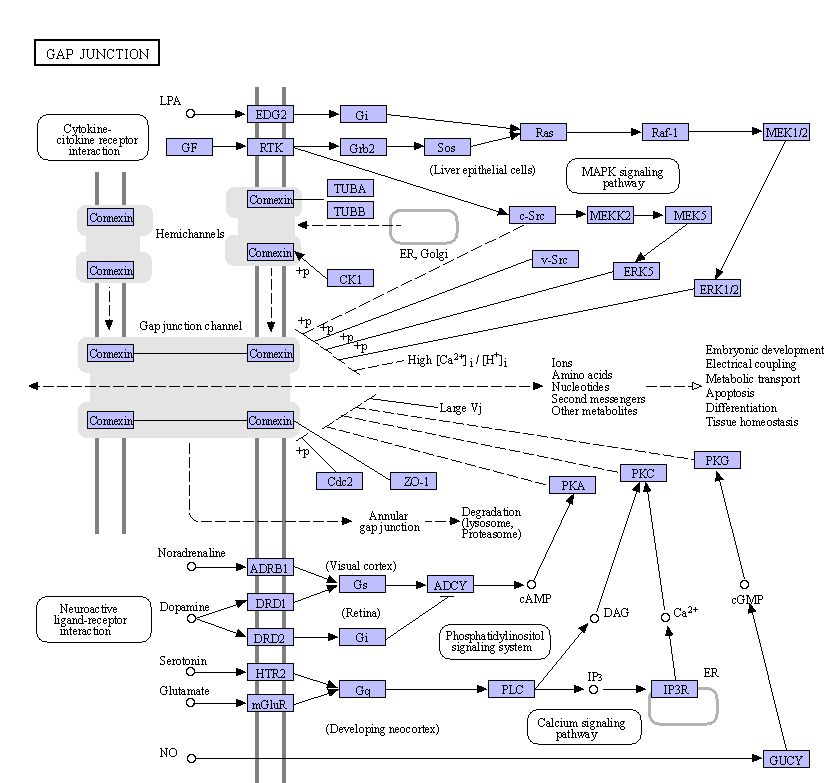

# 3.3.4 KO分析

&emsp;&emsp;ko 编号表示一个通路，这个通路是不分物种的，相当于所有物种的这一通路的并集。K 编号表示一个基因，是 ko 通路中的基本单位，某一 K 编号代表的不是某一具体物种的基因，而是所有物种的某一同源基因的统称。 

&emsp;&emsp;在 enrichKEGG.csv文件中可以查询到对应的ko编号，打开URL ([https://www.genome.jp/pathwayko04540](https://www.genome.jp/pathwayko04540))的网页，可查看实验组和对照组差异表达基因在 Pathway 通路上的不同。下图为一个代谢通路图示例（仅为图片示例，不能演示 KEGG 网站中的动态效果）。 

图17 代谢通路图示例

