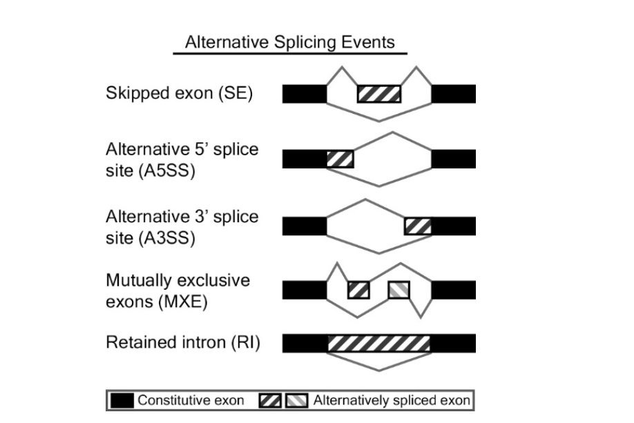
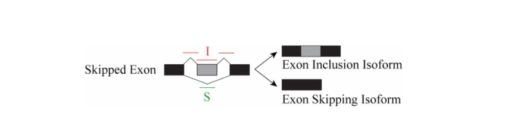

# 3.4.2 差异可变剪切分析
&emsp;&emsp;可变剪切(Alternative Splicing，AS)是一种在真核生物中非常普遍的基因表达方式，具体表现为一个基因的外显子以不同的方式剪接形成不同的成熟 RNA，是调节基因表达和产生蛋白组多样性的重要原因。 

&emsp;&emsp;rMATS ([http://rnaseq-mats.sourceforge.net/index.html](http://rnaseq-mats.sourceforge.net/index.html)) 是一款对 RNA-Seq 数据进行差异可变剪切分析的软件，其通过 rMATS 统计模型统计并定量不同样本（有生物学重复的）间的可变剪切事件。rMATS 可识别的可变剪切事件有5种，分别是 skipped exon (SE) 跳过外显子，alternative 5′ splice site (A5SS) 外显子3′剪切位点可变（即其后的内含子的5′剪切位点可变），alternative 3′ splice site (A3SS) 外显子5′可变剪切（即其前的内含子的3′剪切位点可变），mutually exclusive exons (MXE) 互斥外显子和 retained intron (RI) 保留内含子。图示如下： 

&emsp;&emsp;rMATS 的定量方式有两种，一种是 Junction counts，只用到了跨越剪接位点的 Reads；另外一种是 Reads On Target And Junction Counts，考虑到了比对到剪接片段的所有 Reads。一般情况下，比较两组样品的差异可变剪接只需 Junction counts 的结果。这里我们给 Junction counts 的结果。rMATS 的统计原理为：ф= (I/LI) / (I/LI + S/LS) 

&emsp;&emsp;ф(exon inclusion level)用来定量可变剪切，即包含可变剪切事件区域的转录本在包含和跳过可变剪切事件区域的转录本中的百分比。△ф (△ф = | ф1- ф2 |)和 FDR 值用来确认两组样品间是否存在差异可变剪切，ф1 和 ф2 分别为两组样品的 exon inclusion level，当满足 △ф >5% 且 FDR <=1% 时，认为两组样品在该剪切位点发生了差异可变剪切。下表是 rMATS 识别到的5种可变剪切数量的数据。 

表4 可变剪切数量统计

|  Sample  | SE  |A5SS|A3SS|MXE|SE|RI|
| :--------: | :--------: | :--------: | :--------: | :--------: | :--------: | :--------: |
{{tables}}

**注**：
- Sample：样本名；
- AE：跳过外显子；
- A5SS：外显子3′剪切位点可变（即其后的内含子的5′剪切位点可变）；
- A3SS：外显子5′可变剪切（即其前的内含子的3′剪切位点可变）；
- MXE：互斥外显子；
- SE：跳过外显子；
- RI：保留内含子