# 2.1.4 碱基质量分布

&emsp;&emsp;测序错误率受测序仪本身、测序试剂、样品等多个因素共同影响。 对于 RNASeq 技术，测序错误率分布具有两个特点： 

- 测序错误率会随着测序序列的长度增加而升高，这是由测序过程中化学试剂的消耗导致的，是 Illumina 高通量测序平台都具有的特征
- 前6个碱基的位置（即建库过程中反转录所需要的随机引物的长度）也会发生较高的测序错误率，这种错误是由随机引物和 RNA 模板的不完全结合引起的

&emsp;&emsp;我们用测序数据的单碱基质量分布图评价单个位置的碱基质量。一般而言，Reads 的 5’端和 3’端的碱基质量较低，中间部分的碱基质量较高。大部分序列的碱基质量在20以上，代表测序质量较好。 

**质控和过滤前质量分布图**：

G42H-1

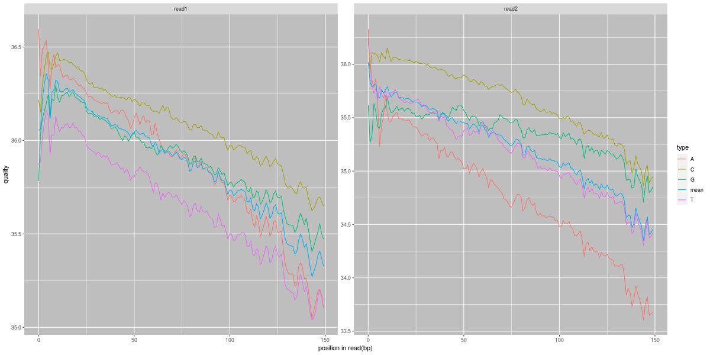注：横坐标是Reads中碱基位置（5'->3'），横坐标是该位点某碱基质量值

G42H-2

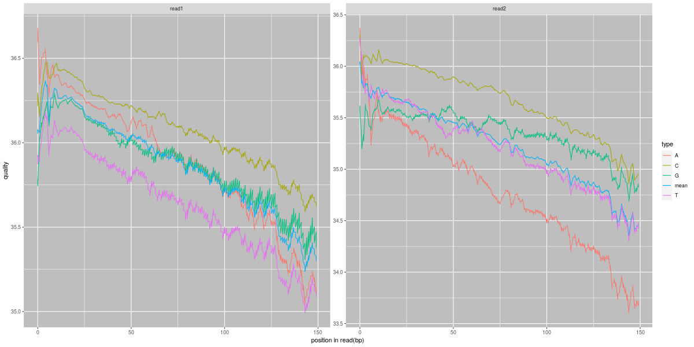注：横坐标是Reads中碱基位置（5'->3'），横坐标是该位点某碱基质量值

G42H-3

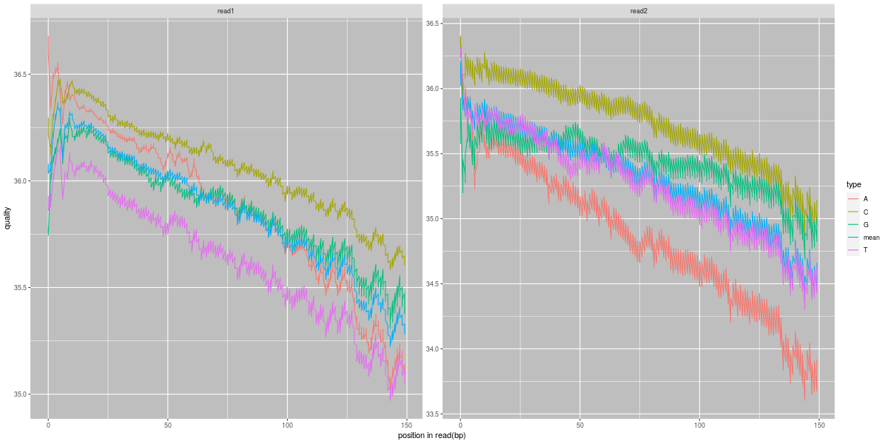注：横坐标是Reads中碱基位置（5'->3'），横坐标是该位点某碱基质量值

G42L-1

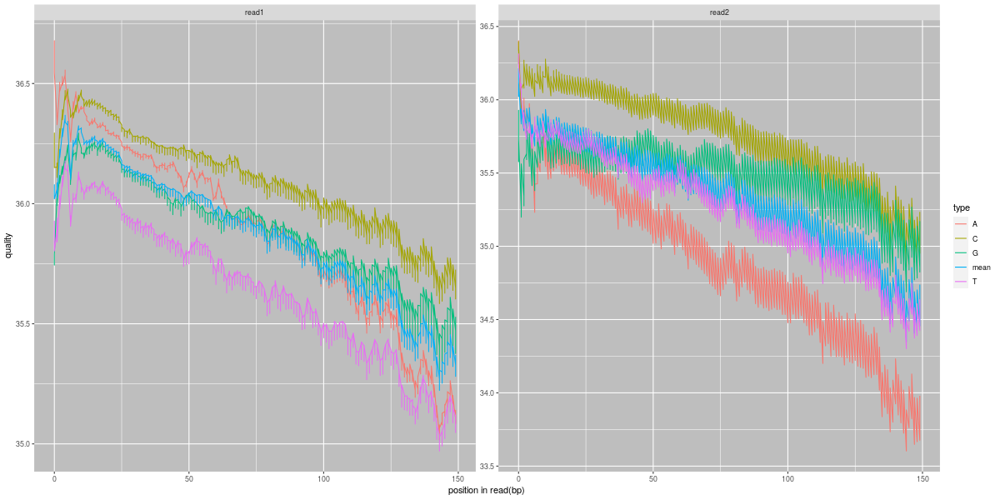注：横坐标是Reads中碱基位置（5'->3'），横坐标是该位点某碱基质量值

G42L-2

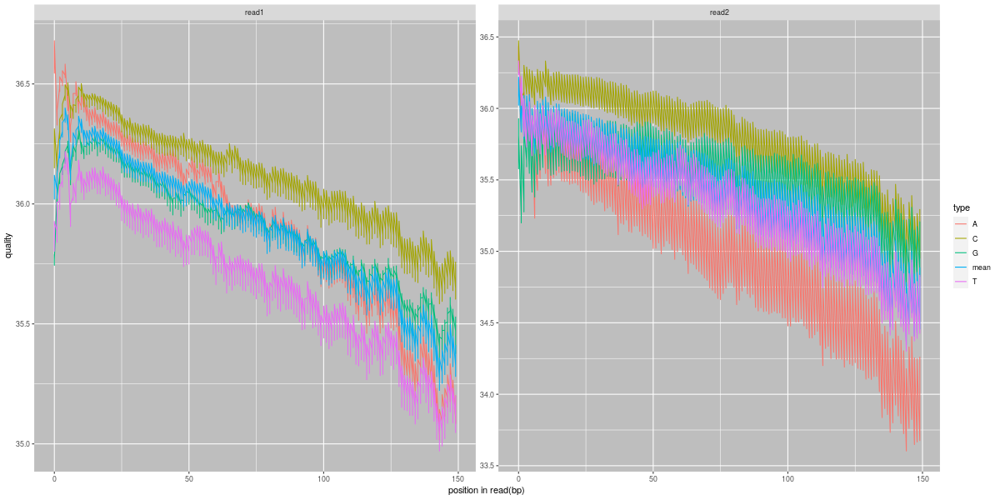注：横坐标是Reads中碱基位置（5'->3'），横坐标是该位点某碱基质量值

G42L-3

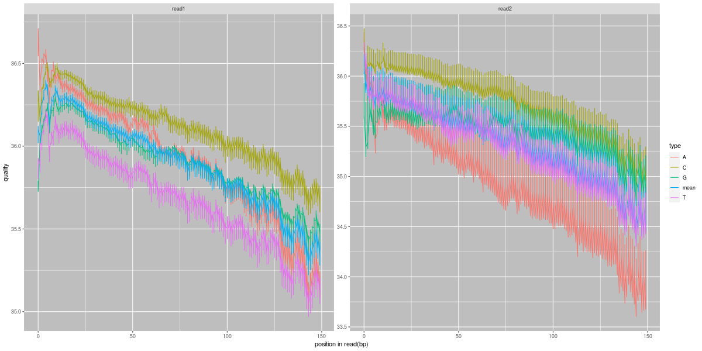注：横坐标是Reads中碱基位置（5'->3'），横坐标是该位点某碱基质量值

G63H-1

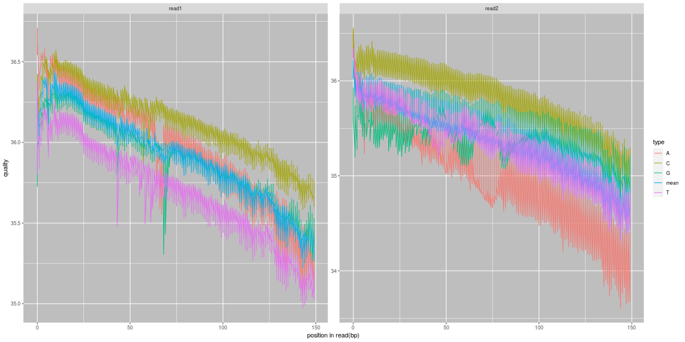注：横坐标是Reads中碱基位置（5'->3'），横坐标是该位点某碱基质量值

G63H-2

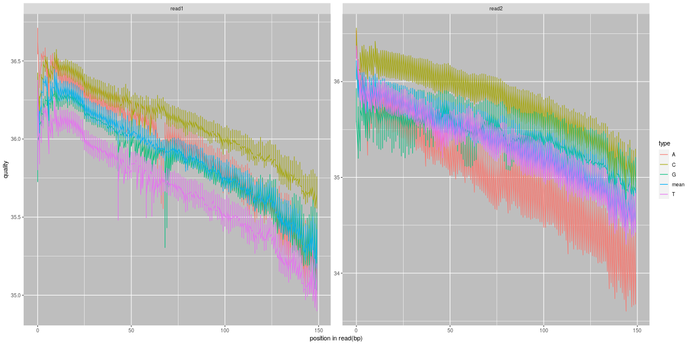注：横坐标是Reads中碱基位置（5'->3'），横坐标是该位点某碱基质量值

G63H-3

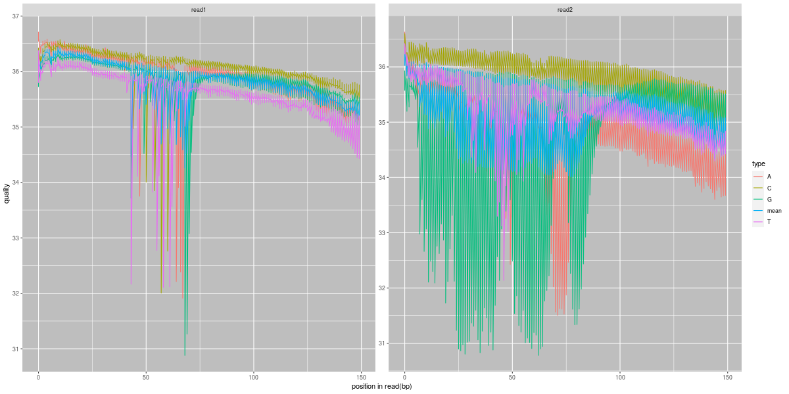注：横坐标是Reads中碱基位置（5'->3'），横坐标是该位点某碱基质量值

G63L-1

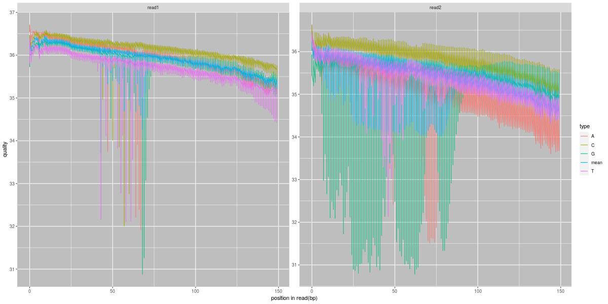注：横坐标是Reads中碱基位置（5'->3'），横坐标是该位点某碱基质量值

G63L-2

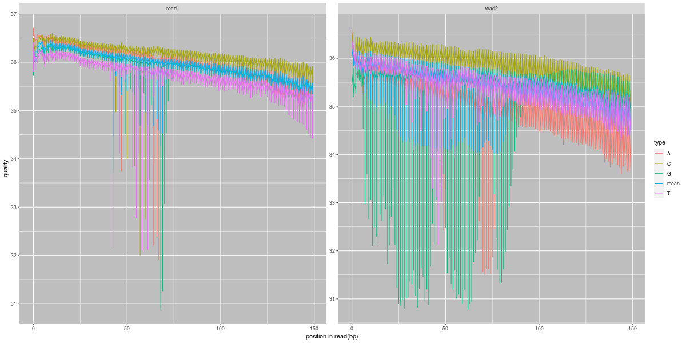注：横坐标是Reads中碱基位置（5'->3'），横坐标是该位点某碱基质量值

**质控和过滤后质量分布图**：

G42H-1

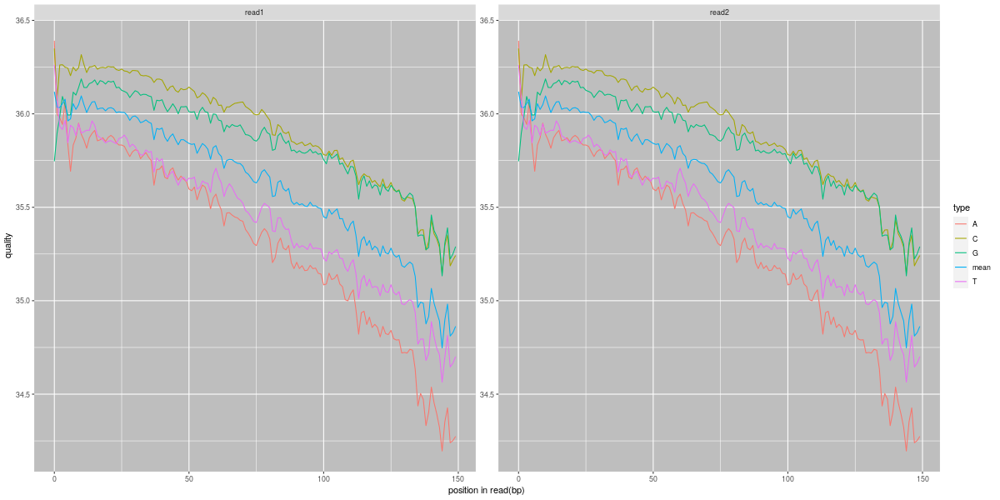注：横坐标是Reads中碱基位置（5'->3'），横坐标是该位点某碱基质量值

G42H-2

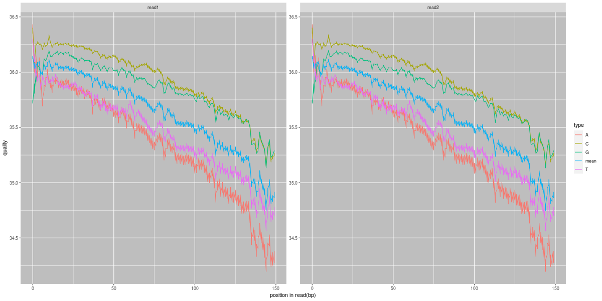注：横坐标是Reads中碱基位置（5'->3'），横坐标是该位点某碱基质量值

G42H-3

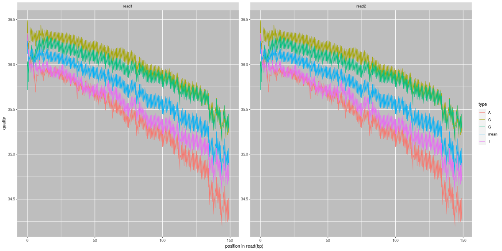注：横坐标是Reads中碱基位置（5'->3'），横坐标是该位点某碱基质量值

G42L-1

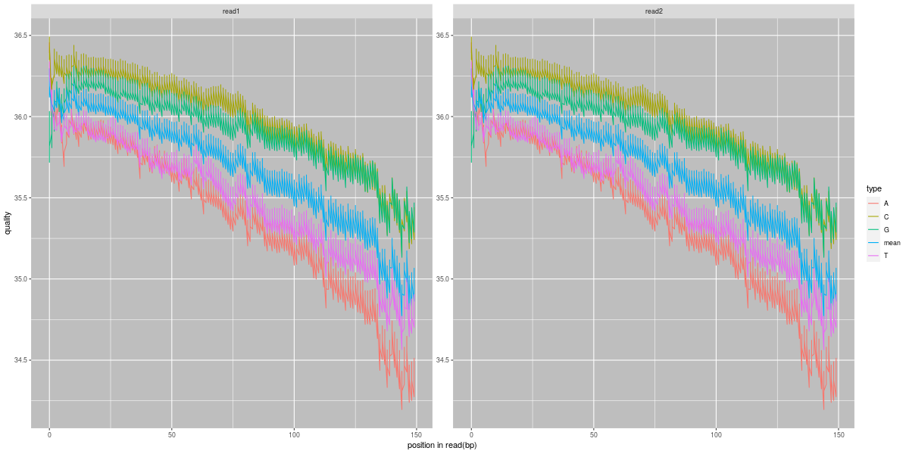注：横坐标是Reads中碱基位置（5'->3'），横坐标是该位点某碱基质量值

G42L-2

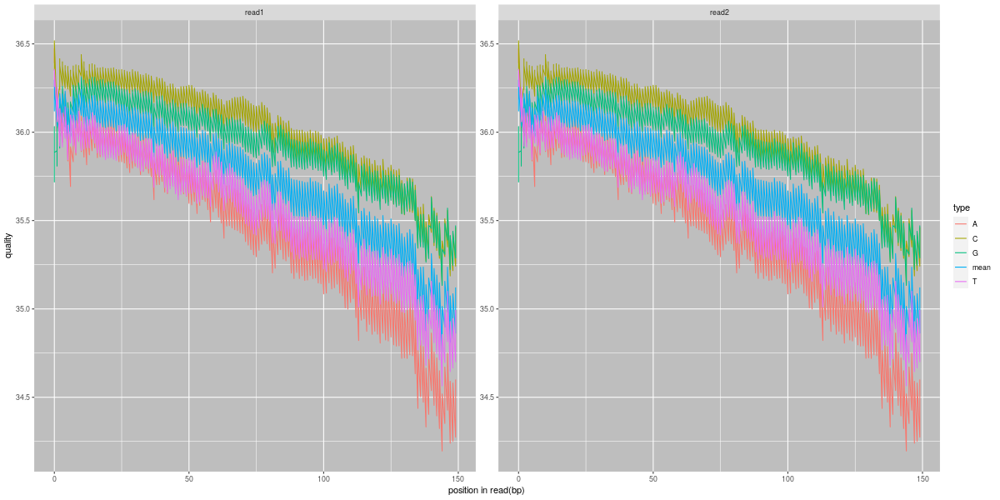注：横坐标是Reads中碱基位置（5'->3'），横坐标是该位点某碱基质量值

G42L-3

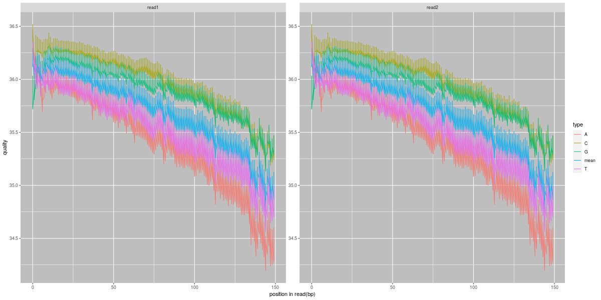注：横坐标是Reads中碱基位置（5'->3'），横坐标是该位点某碱基质量值

G63H-1

注：横坐标是Reads中碱基位置（5'->3'），横坐标是该位点某碱基质量值

G63H-2

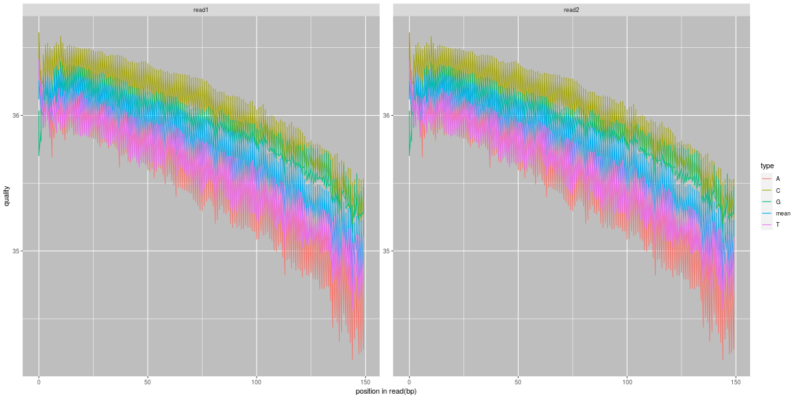注：横坐标是Reads中碱基位置（5'->3'），横坐标是该位点某碱基质量值

G63H-3

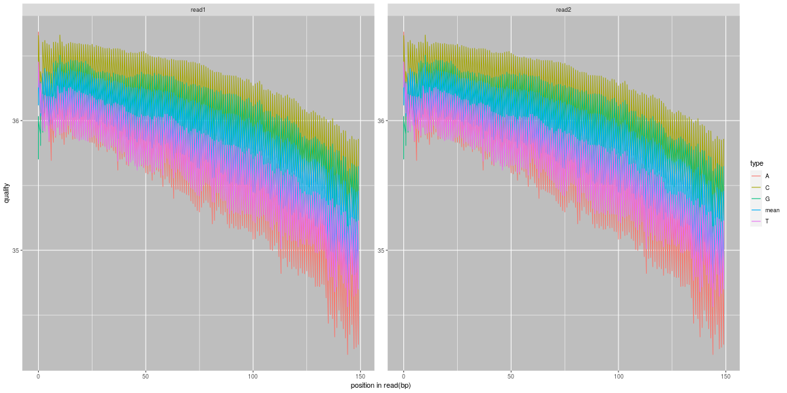注：横坐标是Reads中碱基位置（5'->3'），横坐标是该位点某碱基质量值

G63L-1

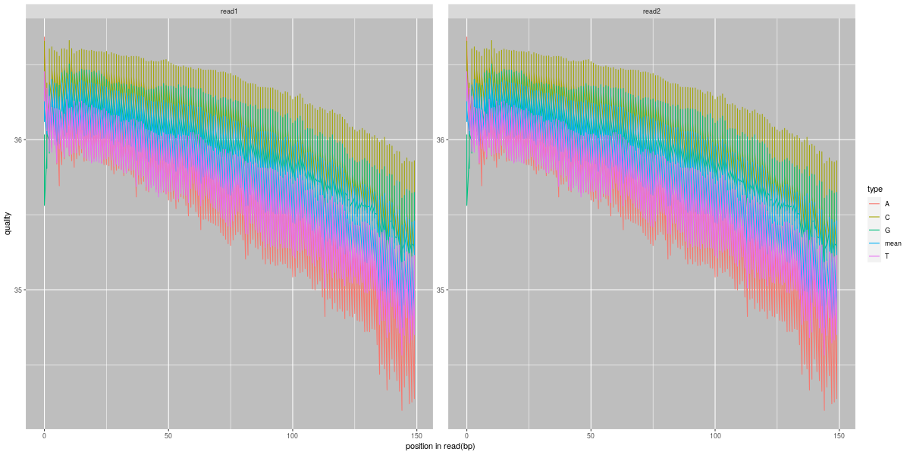注：横坐标是Reads中碱基位置（5'->3'），横坐标是该位点某碱基质量值

G63L-2

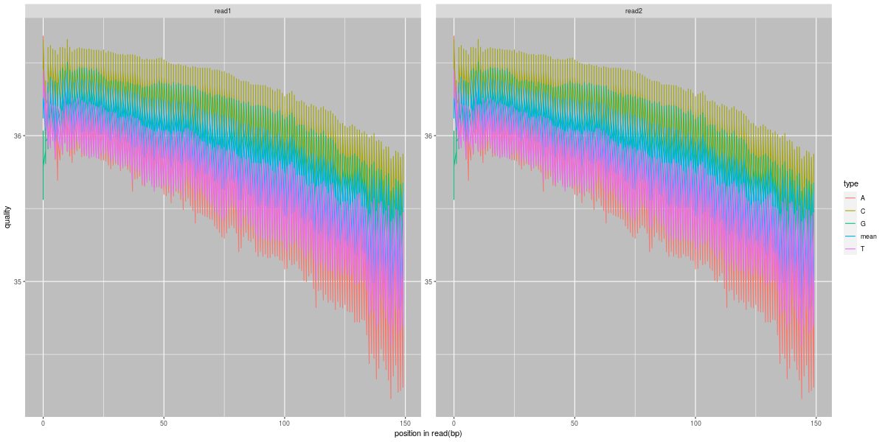注：横坐标是Reads中碱基位置（5'->3'），横坐标是该位点某碱基质量值

