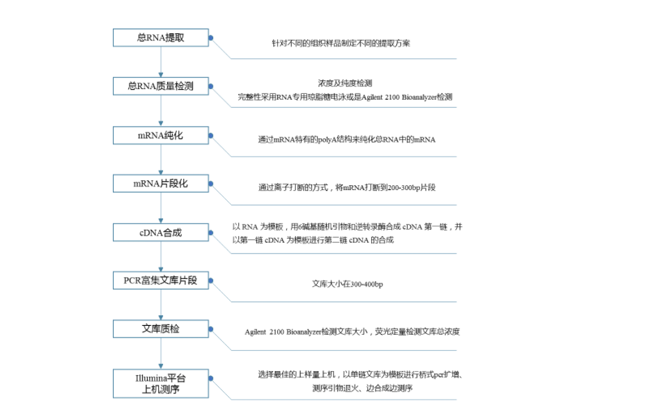

# 1.2 实验流程

&emsp;&emsp;武汉增强子生物从样本提取到上机测序，有严格的样本检测、质控流程，通过各环节对样本质量控制，
确保数据的真实可信。操作流程如下:

图1 测序实验流程

&emsp;&emsp;本项目通过 Oligo(dT) 磁珠富集总 RNA 中带有 polyA 结构的 mRNA，采用离子打断的方式，将 RNA 打断到长度300bp左右的片段。选择长度为300bp的片段，这是因为接头长度是固定的，如被打断的片段长度较短，将导致接头序列的比例偏高，从而降低了有效数据的比例；如被打断的片段长度较长，则不利于上机测序过程中簇的生成。以 RNA 为模板，用6碱基随机引物和逆转录酶合成 cDNA 第一链，并以第一链 cDNA 为模板进行第二链 cDNA 的合成。 

&emsp;&emsp;文库构建完成后，采用PCR扩增进行文库片段富集，之后根据片段大小进行文库选择，文库大小在380bp。接着，通过 Agilent 2100 Bioanalyzer 对文库进行质检，再对文库总浓度及文库有效浓度进行检测。然后根据文库的有效浓度以及文库所需数据量，将含有不同 Index 序列（各样本加上不同的 Index，最后根据 Index 区分各样本的下机数据）的文库按比例进行混合。混合文库统一稀释到2nM，通过碱变性，形成单链文库。 

&emsp;&emsp;样品经过 RNA 抽提、纯化、建库之后，采用第二代测序技术（Next-Generation Sequencing，NGS），基于 Illumina NovaSeq 测序平台，对这些文库进行双末端 （Paired-end，PE）测序。