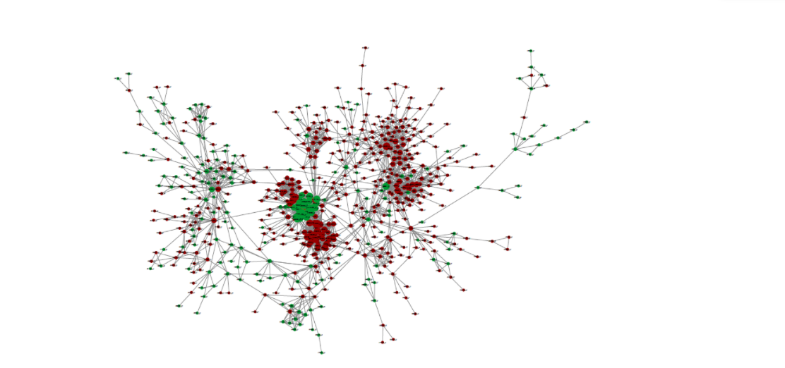

# 第四部分 蛋白网络互作分析

&emsp;&emsp;STRING (Search3 Tool for the Retrieval of Interacting Genes/Proteins) 是EMBL开发的蛋白质互作数据库，该数据库从最有力的实验证据到数据挖掘、同源预测的蛋白质互作关系都有收录。我们依据 STRING 数据库进行蛋白互作分析，以此揭示目的基因之间的作用关系。 

&emsp;&emsp;当STRING数据库中收录该物种的PPI信息时，我们根据基因差异表达分析结果，直接数据库中筛选含有差异基因并且Score>0.95的PPI作用对。当网络过大或过小时，可调节Score值。 

&emsp;&emsp;当STRING数据库中没有该物种的PPI信息时，我们选择相近物种与该物种的蛋白质序列进行比对，进而得到该物种的蛋白质之间的相互关系。（对于无参考基因组的转录组测序项目，我们选择相近物种与该物种的Unigene序列进行比对。） 

&emsp;&emsp;然后再筛选含有差异基因并且Score>0.95的PPI作用对（当网络过小时，我们把与之相关的非显著差异表达基因也列出）。最终获得所有目的基因之间相互关系（*.PPI.network.txt），通过Cytoscape进行做图。同时，根据基因差异表达分析得到属性文件（*.PPI.attributes.txt），对网络图中的节点颜色和大小进行调整。 

图1 PPI网络-基因表达量示意图

**注**: 图为蛋白质互作网络与表达量结合的网络图，图中的点为基因（对应的蛋白质），其中红色表示上调基因，绿色表示下调基因，黄色表达非显著差异表达基因。

表1 节点属性文件示例

| Node | Regulation| Type| Degree|
| :---: | :---: | :---: | :---: |
|gene1|Up Regulation|mRNA|2|
|gene2|Up Regulation|mRNA|6|
|gene3|Up Regulation|mRNA|4|
|gene4|Up Regulation|mRNA|32|
|gene5|Down Regulation|mRNA|12|
|gene6|Down Regulation|mRNA|23|
|gene7|Down Regulation|mRNA|5|

**注**: 
- Node：网络中基因节点名称;
- Regulation：对应基因的上下调类型;
- Type：基因类型为mRNA;
- Degree：基因结点在网络图中的自由度，周围邻居结点的个数

表2 PPI互作关系文件示例

| Node1 | Node2|   Score|
| :---: | :---: | :---: |
|gene1|gene2|0.964|
|gene1|gene3|0.995|
|gene2|gene4|0.988|
|gene3|gene5|0.98|
|gene4|gene6|0.997|

**注**: 
- Node1，Node2：相互作用的两个基因;
- Score：PPI作用对的分值